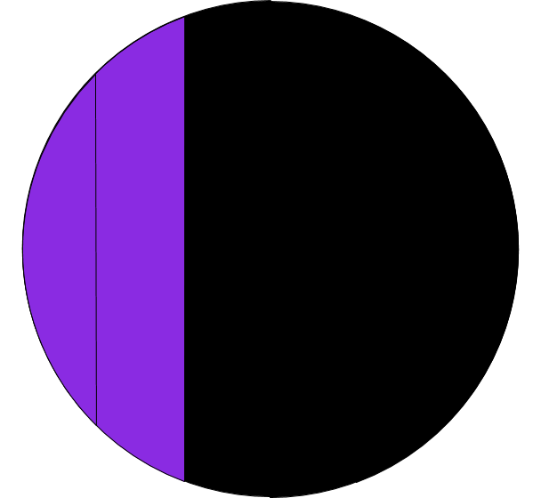
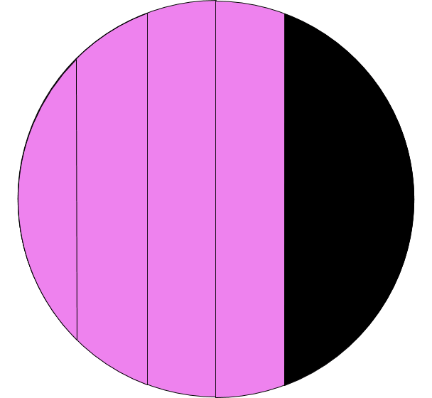

| *Lamp in action* |
| :---: |
|  |

# Set-up and running
# Reading screens
## Color Guide
This is helpful when trying to determine which screen you are looking at based on the color:

| Color                  | Screen                                   |
|------------------------|------------------------------------------|
| White and/or Dark Blue | [Moon](#moon)                            |
| Light Blue             | [Feels like (-10 to 19)](#feels-like)    |
| Blue                   | [Feels like (20 to 49)](#feels-like)     |
| Lime Green             | [Feels like (50 to 79)](#feels-like)     |
| Orange                 | [Feels like (80 to 109)](#feels-like)    |
| Red                    | [Feels like (110 to 130)](#feels-like)   |
| Yellow                 | [Sunniness](#sunniness)                  |
| Indigo                 | [Precipitation (Rain)](#precipitation)   |
| Violet                 | [Precipitation (Snow)](#precipitation)   |

## Moon
The moon screen, by default, shows the current moon phase.
It can also be used to show a fixed phase.
Using this, a screen could be created to cycle through the phases.

To read the screen, the lamp will light up what part of the moon is visible with
white and the dark side of the moon with a dark blue. Some example phases (more can be found in `/static`):
 
| *New moon* | *Waxing crescent* |
| :---: | :---: |
|  |  |
| *First quarter* | *Full moon* |
|  |  |
| *Third quarter* | *Waning gibbous* |
|  |  |
 
## Feels like
The feels like screen, by default, shows the current local feels like temperature.
It uses four colors LIGHT BLUE, BLUE, LIME GREEN, ORANGE, and RED
using these rules based on the feels like temperature:

| Temperature range (&deg;F) | Color      |
| ---                        | ---        |
| -10 (or below) to 20       | Light Blue |
| 20 to 50                   | Blue       |
| 50 to 80                   | Lime green |
| 80 to 110                  | Orange     |
| 110 to 130 (or above)      | Red        |

Each of those ranges (except the top and bottom, more on that later) has 30 degrees which is then divided into 
six groups of 5 degrees and the corresponding number of lamp segments is filled in with the above color.
For example,  if it's 54&deg;F, the lamp would be LIME GREEN and one segment would be filled in.
If it were 55&deg;F, two segments would be filled in.

Example images:

| *50&deg;F - 54&deg;F (i.e. low 50s)* | *55&deg;F - 59&deg;F (i.e. upper 50s)* |
| :---: | :---: |
|  |  |
| *30&deg;F - 34&deg;F (i.e. low 30s)* | *35&deg;F - 49&deg;F (i.e. upper 30s)* |
|  |  |
| *70&deg;F - 74&deg;F (i.e. low 70s)* | *75&deg;F - 79&deg;F (i.e. upper 70s)* |
|  |  |

If the temperature is below -10&deg;F or above 130&deg;F, the lamp will use the corresponding color
(LIGHT BLUE and RED respectively) but light up in an on, off, on, on, off, on pattern:

Example images:

| *Below -10&deg;F* | *Above 130&deg;F* |
| :---: | :---: |
|  |  |

## Sunniness
The sunniness screen shows what percentage of the sky is clear (i.e. the inverse of cloudiness).
If there is 25% cloud cover, then it's 75% sunny.
The screen takes the sunniness percentage and finds the nearest 1/6th percent and lights up that number of LEDs.
Additionally, it will light up the next LEDs at a lower power so you can see roughly if it's closer to,
for example, 16% sunny or 33% sunny.
If it's 0% sunny (100% cloudy),
the first segment will light up at a minimum value so you know it's on the sunniness screen.

Example images:

| *100% sunny (0% cloud cover)* | *0% sunny (100% cloud cover)* |
| :---: | :---: |
|  |  |
| *25% sunny (75% cloud cover)* | *50% sunny (50% cloud cover)* |
|  |  |

## Precipitation
This screen shows the type of precipitation and the probability for the day.
Violet means snow and Blue-violet means rain and the number of sections that are lit up corresponds to the percent change
of that happening for the day.
If the percent of precipitation is very low (<8%), this screen will not show up.

Example images:

| *30% chance of rain* | *60% chance of snow* |
| :---: | :---: |
|  |  |

